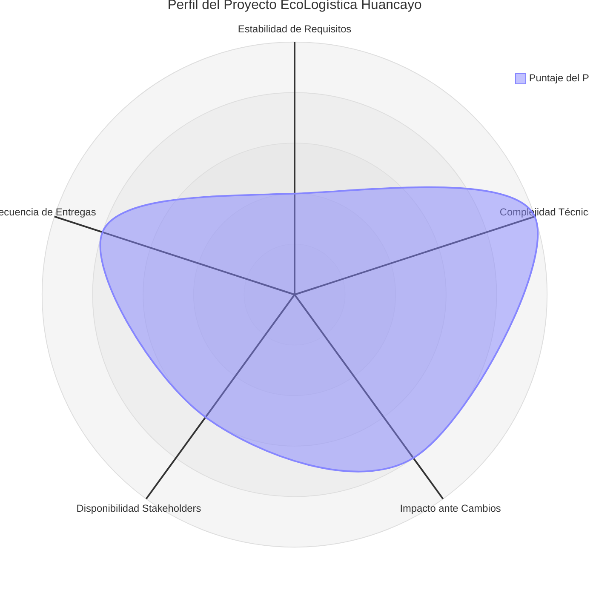

# Selección del Enfoque del Proyecto

## 1. Encabezado de Metadatos

| Campo | Detalle |
|---|---|
| **Nombre del Proyecto** | EcoLogística Huancayo — Optimizador de Rutas Sostenibles para "DistriRápido S.A.C." |
| **Integrantes** | Manuel Yeferson Parraga Recuay, Sheila Suarez Suarez, David André Guevara Moscoso, Jair Felix Romero |
| **Docente** | Job Daniel Gamarra Moreno |
| **Fecha** | 28 de agosto de 2026 |
| **Versión** | 1.0.0 |

---

## 2. Matriz de Ponderación de Variables

La matriz evalúa, en una escala de **1 (muy bajo) a 5 (muy alto)**, cinco variables clave descritas en la guía **PMBOK 8ª Edición** para determinar la orientación metodológica más adecuada (Predictiva, Ágil o Híbrida).

| N° | Variable | Puntaje (1-5) | Peso (%) | Puntaje Ponderado | Justificación |
|---|---|---|---|---|---|
| 1 | Claridad y estabilidad de requisitos | 2 | 20% | 0.40 | Los requerimientos funcionales (RF-01 a RF-10) están enumerados en la consigna, pero deben adaptarse a la realidad geográfica y vial de Huancayo (nomenclatura de direcciones en zonas periféricas, feria dominical, restricciones locales), lo que exige validación continua con el negocio. |
| 2 | Complejidad técnica e innovación | 5 | 25% | 1.25 | El proyecto requiere implementar una metaheurística (Algoritmo Genético, Búsqueda Tabú u Optimización por Colonia de Hormigas) para resolver un VRPTW con enfoque Green VRP, además de integración con mapas, tráfico en tiempo real y generación de reportes: alta complejidad algorítmica y de integración. |
| 3 | Severidad del impacto ante cambios | 4 | 20% | 0.80 | Un cambio en las restricciones (normativa de tránsito, zonas de riesgo, condiciones climáticas de Huancayo) impacta directamente el motor de optimización y el modelo de datos geográficos. |
| 4 | Disponibilidad de los interesados (stakeholders) | 3 | 15% | 0.45 | La disponibilidad de conductores, representantes de "DistriRápido S.A.C." y del docente es moderada, concentrada en las fechas de revisión de cada iteración del cronograma sugerido. |
| 5 | Frecuencia de entregas de valor | 4 | 20% | 0.80 | El cronograma sugerido exige 4 iteraciones (semanas 1-14) con entregables funcionales verificables al cierre de cada una. |
| | **Total** | | **100%** | **3.70 / 5** | Perfil orientado hacia un enfoque **Híbrido con fuerte componente ágil**. |

---

## 3. Diagrama de Radar del Enfoque

### Tabla descriptiva complementaria

| Eje del radar | Valor | Interpretación |
|---|---|---|
| Estabilidad de Requisitos | Bajo (2/5) | Los RF/RNF deben ajustarse continuamente a las particularidades operativas de Huancayo (vías no pavimentadas en Chilca alta y zonas altas, feria dominical, clima). |
| Complejidad Técnica | Muy Alto (5/5) | El motor de metaheurísticas (VRPTW + Green VRP), la integración de mapas y el cálculo de indicadores ambientales exigen un diseño técnico robusto desde el inicio. |
| Impacto ante Cambios | Alto (4/5) | Cambios en restricciones normativas o geográficas afectan directamente el núcleo del algoritmo de ruteo. |
| Disponibilidad de Stakeholders | Medio (3/5) | Retroalimentación concentrada por hitos de iteración, no continua. |
| Frecuencia de Entregas | Alto (4/5) | El cronograma de 4 iteraciones exige incrementos funcionales verificables cada 3-4 semanas. |

---

## 4. Decisión y Justificación del Enfoque

### Enfoque seleccionado: **Híbrido (Predictivo-Adaptativo)**

De acuerdo con el *PMBOK Guide – 8ª Edición* (Project Management Institute), la selección del enfoque de desarrollo debe basarse en el grado de incertidumbre del proyecto, la estabilidad de los requisitos y la necesidad de entrega temprana de valor, y no en una preferencia metodológica fija.

El proyecto EcoLogística Huancayo combina dos naturalezas claramente diferenciadas:

1. **Componente algorítmico y arquitectónico (predictivo):** el diseño del modelo de datos geográfico (flota, pedidos, conductores), la arquitectura de integración con APIs de mapas/tráfico y la selección de la metaheurística base requieren una planificación previa robusta, ya que decisiones tardías sobre el modelo del problema VRPTW tienen alto costo de rediseño. Este componente se gestiona con un enfoque **predictivo** durante la Iteración 1 (semanas 1-3: análisis de requerimientos, investigación de campo en Huancayo y diseño de base de datos).

2. **Componente funcional e iterativo (adaptativo):** la implementación progresiva de la metaheurística (de una versión básica de Algoritmo Genético a una versión avanzada), la visualización de rutas, el dashboard de indicadores y la re-optimización dinámica se desarrollan mediante **iteraciones ágiles** alineadas al cronograma sugerido de 4 iteraciones, con retroalimentación del docente y ajuste continuo del backlog conforme se valida cada incremento con datos reales de Huancayo.

Esta combinación —diseño técnico planificado en la fase de inicio + desarrollo funcional iterativo por incrementos— corresponde al escenario que PMBOK identifica como candidato ideal para un **ciclo de vida híbrido**, permitiendo controlar el riesgo técnico del algoritmo de optimización sin sacrificar la capacidad de adaptación frente a los cambios propios del contexto operativo y geográfico local.

**Conclusión:** el equipo adopta un enfoque híbrido, con una fase inicial predictiva de análisis y diseño (Iteración 1), seguida de tres iteraciones ágiles (Iteraciones 2-4) para el desarrollo funcional, la optimización del algoritmo y el cierre del proyecto.
