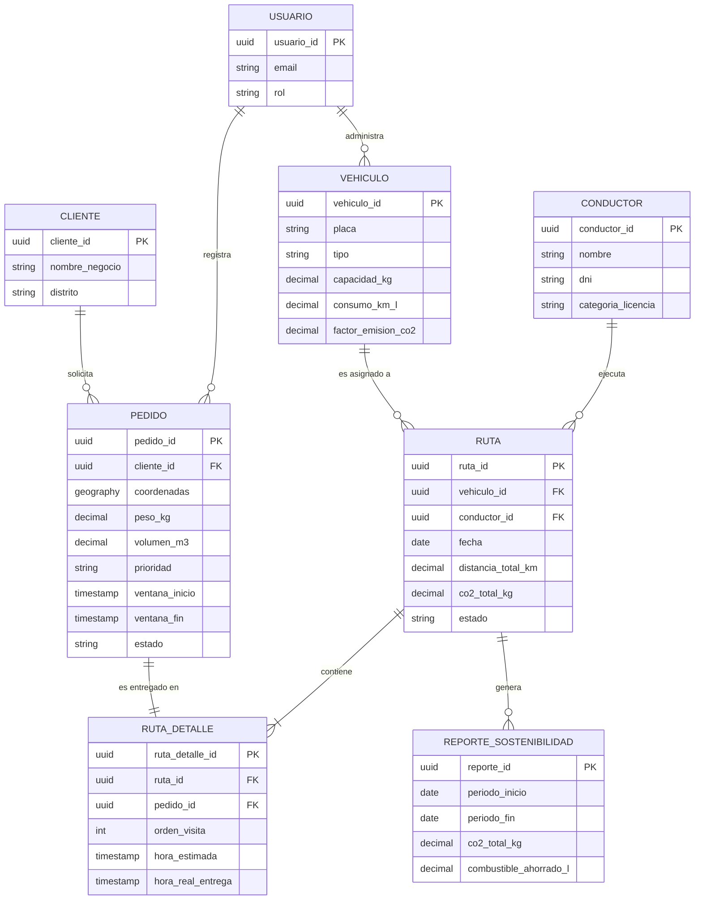

# Diseño e Ingeniería de Base de Datos

**Proyecto:** EcoLogística Huancayo — Optimizador de Rutas Sostenibles para "DistriRápido S.A.C."
**Versión:** 1.0.0 | **Fecha:** 28 de agosto de 2026
**Motor:** PostgreSQL 16 + extensión PostGIS

---

## 1. Modelo Conceptual (Diagrama Entidad-Relación)



---

## 2. Modelo Lógico

| Entidad | Atributo | Tipo | Restricción | Observación |
|---|---|---|---|---|
| **usuarios** | usuario_id | UUID | PK | Identificador único |
| | email | VARCHAR(255) | NOT NULL, UNIQUE | — |
| | password_hash | VARCHAR(255) | NOT NULL | Hash, nunca texto plano |
| | rol | VARCHAR(30) | NOT NULL | Administrador, Operador, Auditor |
| | estado | VARCHAR(20) | NOT NULL, DEFAULT 'ACTIVO' | — |
| **vehiculos** | vehiculo_id | UUID | PK | — |
| | placa | VARCHAR(10) | NOT NULL, UNIQUE | RF-001 |
| | tipo | VARCHAR(20) | NOT NULL | camioneta, furgón, moto |
| | capacidad_kg | NUMERIC(8,2) | NOT NULL, CHECK > 0 | — |
| | consumo_km_l | NUMERIC(6,2) | NOT NULL, CHECK > 0 | — |
| | factor_emision_co2 | NUMERIC(6,3) | NOT NULL | kg CO₂/km, RN-008 |
| | anio_fabricacion | SMALLINT | NOT NULL | RN-002 |
| **conductores** | conductor_id | UUID | PK | — |
| | dni | VARCHAR(8) | NOT NULL, UNIQUE | — |
| | categoria_licencia | VARCHAR(5) | NOT NULL | — |
| | horas_conducidas_dia | NUMERIC(4,2) | DEFAULT 0, CHECK ≤ 8 | RN-003 |
| **clientes** | cliente_id | UUID | PK | — |
| | nombre_negocio | VARCHAR(150) | NOT NULL | Bodega/mercado |
| | distrito | VARCHAR(50) | NOT NULL | El Tambo, Chilca, Huancayo, Pilcomayo, etc. |
| **pedidos** | pedido_id | UUID | PK | — |
| | cliente_id | UUID | FK → clientes | — |
| | coordenadas | GEOGRAPHY(POINT, 4326) | NOT NULL | PostGIS, RF-002 |
| | punto_referencia | TEXT | NULLABLE | Direcciones no estándar, RF-002 |
| | peso_kg | NUMERIC(8,2) | NOT NULL, CHECK > 0 | RN-006 |
| | volumen_m3 | NUMERIC(6,2) | NOT NULL, CHECK > 0 | — |
| | prioridad | VARCHAR(15) | NOT NULL | express, estándar, económico |
| | ventana_inicio / ventana_fin | TIMESTAMPTZ | NOT NULL | RN-005 |
| | estado | VARCHAR(30) | NOT NULL, DEFAULT 'PENDIENTE' | — |
| **rutas** | ruta_id | UUID | PK | — |
| | vehiculo_id / conductor_id | UUID | FK | — |
| | fecha | DATE | NOT NULL | — |
| | distancia_total_km / co2_total_kg | NUMERIC(10,2) | NOT NULL, DEFAULT 0 | RN-008 |
| **ruta_detalle** | ruta_detalle_id | UUID | PK | — |
| | ruta_id / pedido_id | UUID | FK | — |
| | orden_visita | SMALLINT | NOT NULL | — |
| | hora_real_entrega | TIMESTAMPTZ | NULLABLE | RN-010 |

**Nivel de normalización:** el modelo cumple **Tercera Forma Normal (3FN)** — cada atributo no clave depende exclusivamente de la clave primaria de su entidad (ej. `factor_emision_co2` depende del vehículo, no de la ruta; el CO₂ total de la ruta se deriva por cálculo/agregación, no se almacena redundantemente salvo como campo materializado de reporte para RNF-001).

---

## 3. Modelo Físico (DDL SQL) e Índices

```sql
CREATE EXTENSION IF NOT EXISTS postgis;
CREATE EXTENSION IF NOT EXISTS "pgcrypto";

CREATE TABLE usuarios (
    usuario_id UUID PRIMARY KEY DEFAULT gen_random_uuid(),
    email VARCHAR(255) NOT NULL UNIQUE,
    password_hash VARCHAR(255) NOT NULL,
    rol VARCHAR(30) NOT NULL CHECK (rol IN ('ADMINISTRADOR','OPERADOR','AUDITOR')),
    estado VARCHAR(20) NOT NULL DEFAULT 'ACTIVO',
    creado_en TIMESTAMP WITH TIME ZONE DEFAULT CURRENT_TIMESTAMP
);

CREATE TABLE vehiculos (
    vehiculo_id UUID PRIMARY KEY DEFAULT gen_random_uuid(),
    placa VARCHAR(10) NOT NULL UNIQUE,
    tipo VARCHAR(20) NOT NULL CHECK (tipo IN ('CAMIONETA','FURGON','MOTO')),
    capacidad_kg NUMERIC(8,2) NOT NULL CHECK (capacidad_kg > 0),
    consumo_km_l NUMERIC(6,2) NOT NULL CHECK (consumo_km_l > 0),
    factor_emision_co2 NUMERIC(6,3) NOT NULL CHECK (factor_emision_co2 >= 0),
    anio_fabricacion SMALLINT NOT NULL,
    creado_en TIMESTAMP WITH TIME ZONE DEFAULT CURRENT_TIMESTAMP
);

CREATE TABLE conductores (
    conductor_id UUID PRIMARY KEY DEFAULT gen_random_uuid(),
    nombre VARCHAR(150) NOT NULL,
    dni VARCHAR(8) NOT NULL UNIQUE,
    categoria_licencia VARCHAR(5) NOT NULL,
    anios_experiencia SMALLINT NOT NULL DEFAULT 0,
    horas_conducidas_dia NUMERIC(4,2) NOT NULL DEFAULT 0 CHECK (horas_conducidas_dia <= 8),
    contacto VARCHAR(20),
    creado_en TIMESTAMP WITH TIME ZONE DEFAULT CURRENT_TIMESTAMP
);

CREATE TABLE clientes (
    cliente_id UUID PRIMARY KEY DEFAULT gen_random_uuid(),
    nombre_negocio VARCHAR(150) NOT NULL,
    distrito VARCHAR(50) NOT NULL,
    creado_en TIMESTAMP WITH TIME ZONE DEFAULT CURRENT_TIMESTAMP
);

CREATE TABLE pedidos (
    pedido_id UUID PRIMARY KEY DEFAULT gen_random_uuid(),
    cliente_id UUID NOT NULL REFERENCES clientes(cliente_id),
    coordenadas GEOGRAPHY(POINT, 4326) NOT NULL,
    punto_referencia TEXT,
    peso_kg NUMERIC(8,2) NOT NULL CHECK (peso_kg > 0),
    volumen_m3 NUMERIC(6,2) NOT NULL CHECK (volumen_m3 > 0),
    prioridad VARCHAR(15) NOT NULL CHECK (prioridad IN ('EXPRESS','ESTANDAR','ECONOMICO')),
    tipo_producto VARCHAR(20) NOT NULL DEFAULT 'NO_PERECEDERO',
    ventana_inicio TIMESTAMP WITH TIME ZONE NOT NULL,
    ventana_fin TIMESTAMP WITH TIME ZONE NOT NULL CHECK (ventana_fin > ventana_inicio),
    estado VARCHAR(30) NOT NULL DEFAULT 'PENDIENTE',
    creado_en TIMESTAMP WITH TIME ZONE DEFAULT CURRENT_TIMESTAMP
);

CREATE TABLE rutas (
    ruta_id UUID PRIMARY KEY DEFAULT gen_random_uuid(),
    vehiculo_id UUID NOT NULL REFERENCES vehiculos(vehiculo_id),
    conductor_id UUID NOT NULL REFERENCES conductores(conductor_id),
    fecha DATE NOT NULL,
    distancia_total_km NUMERIC(10,2) NOT NULL DEFAULT 0,
    co2_total_kg NUMERIC(10,2) NOT NULL DEFAULT 0,
    estado VARCHAR(30) NOT NULL DEFAULT 'PLANIFICADA',
    creado_en TIMESTAMP WITH TIME ZONE DEFAULT CURRENT_TIMESTAMP
);

CREATE TABLE ruta_detalle (
    ruta_detalle_id UUID PRIMARY KEY DEFAULT gen_random_uuid(),
    ruta_id UUID NOT NULL REFERENCES rutas(ruta_id) ON DELETE CASCADE,
    pedido_id UUID NOT NULL REFERENCES pedidos(pedido_id),
    orden_visita SMALLINT NOT NULL,
    hora_estimada TIMESTAMP WITH TIME ZONE,
    hora_real_entrega TIMESTAMP WITH TIME ZONE,
    UNIQUE (ruta_id, orden_visita)
);

CREATE TABLE reportes_sostenibilidad (
    reporte_id UUID PRIMARY KEY DEFAULT gen_random_uuid(),
    periodo_inicio DATE NOT NULL,
    periodo_fin DATE NOT NULL CHECK (periodo_fin >= periodo_inicio),
    co2_total_kg NUMERIC(12,2) NOT NULL DEFAULT 0,
    combustible_ahorrado_l NUMERIC(10,2) NOT NULL DEFAULT 0,
    generado_por UUID REFERENCES usuarios(usuario_id),
    creado_en TIMESTAMP WITH TIME ZONE DEFAULT CURRENT_TIMESTAMP
);

-- Índices de soporte a los escenarios de calidad RNF-001 y RNF-010
CREATE INDEX idx_pedidos_estado ON pedidos(estado);
CREATE INDEX idx_pedidos_coordenadas ON pedidos USING GIST (coordenadas);
CREATE INDEX idx_rutas_fecha ON rutas(fecha);
CREATE INDEX idx_ruta_detalle_ruta ON ruta_detalle(ruta_id);
CREATE INDEX idx_vehiculos_placa ON vehiculos(placa);
CREATE INDEX idx_conductores_dni ON conductores(dni);
```
