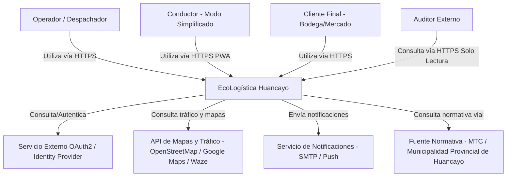
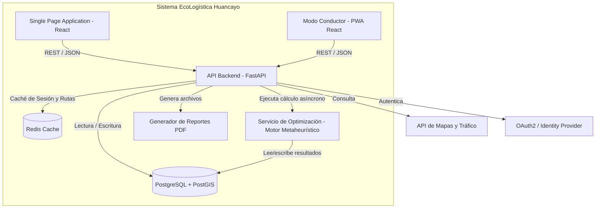
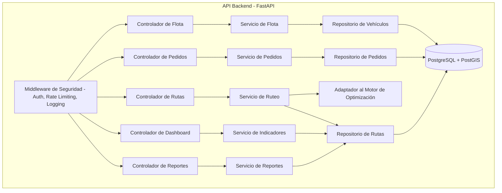

# Arquitectura de Software — Modelo C4

**Proyecto:** EcoLogística Huancayo — Optimizador de Rutas Sostenibles para "DistriRápido S.A.C."
**Versión:** 1.0.0 | **Fecha:** 28 de agosto de 2026

---

## Nivel 1: Diagrama de Contexto

## Nivel 2: Diagrama de Contenedores

## Nivel 3: Diagrama de Componentes (Contenedor API Backend)

### Descripción de Componentes Internos

| Componente | Responsabilidad |
|---|---|
| Middleware de Seguridad | Autenticación (JWT/OAuth2), control de acceso RBAC (Documento 08), limitación de tasa de peticiones y registro de auditoría (RNF-002). |
| Controladores (Flota, Pedidos, Rutas, Dashboard, Reportes) | Exponen los endpoints REST correspondientes a cada requisito funcional (RF-001 a RF-008) y validan el formato de entrada. |
| Servicios | Encapsulan la lógica de negocio y las reglas de negocio (RN-001 a RN-010), independientes del framework web. |
| Adaptador al Motor de Optimización | Traduce el estado actual de pedidos/flota al formato requerido por el algoritmo metaheurístico (Documento 10) y recibe la solución de ruteo. |
| Repositorios | Encapsulan el acceso a PostgreSQL, aislando a los servicios de los detalles del modelo físico (Documento 11). |
